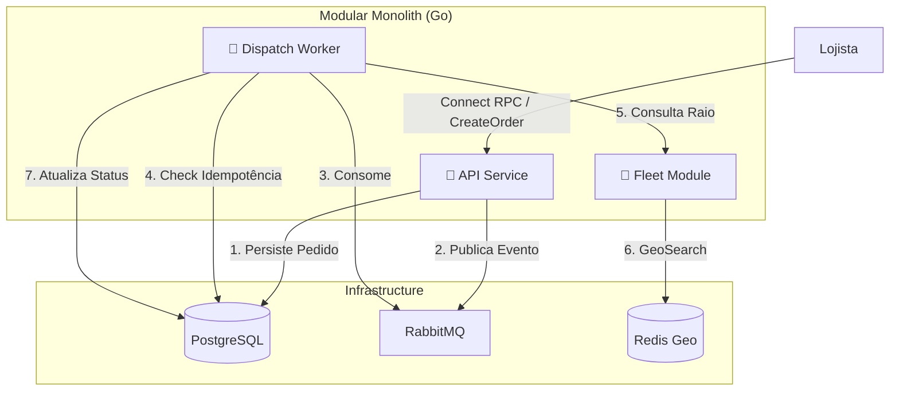
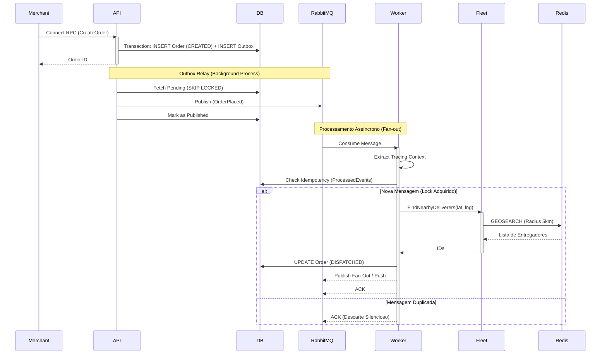
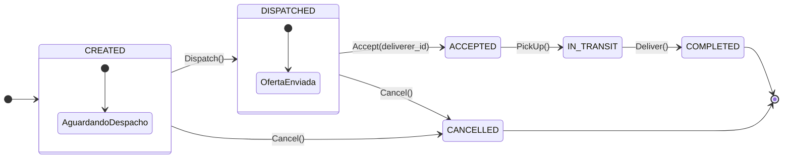
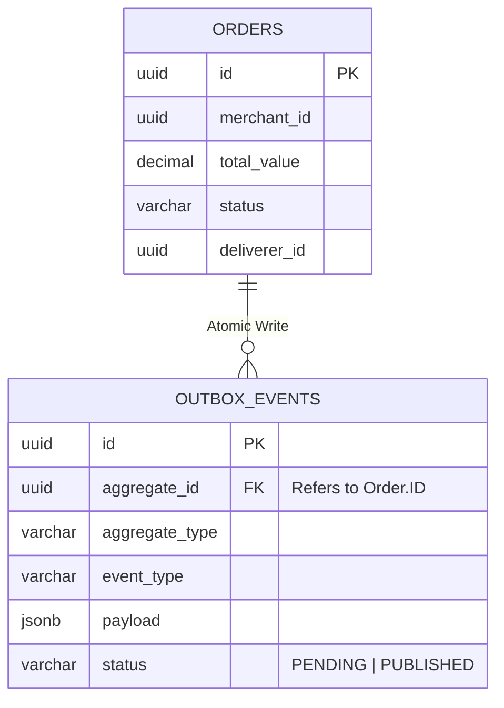

  

# Motor Logístico: Despacho Assíncrono para o Comércio Local

## Visão Geral
Plataforma inteligente de gestão logística e despacho assíncrono projetada para pequenos comércios de bairro. 

O objetivo do sistema é reduzir as taxas abusivas cobradas por grandes aplicativos, conectando diretamente os lojistas locais aos entregadores da região através de um **Motor de Despacho (Fan-out) de alta performance**. O sistema garante resiliência sob pico de carga, resolução de concorrência atômica no aceite de pedidos e roteamento geospacial.

## Arquitetura e Stack
O projeto adota o padrão **Monolito Modular Idiomático em Go**, facilitando a extração para microsserviços no futuro. A comunicação com o frontend (Next.js) é feita através de contratos estritos via **Protocol Buffers (Protobuf)** utilizando o framework **Connect RPC**, garantindo máxima tipagem e performance sem necessidade de proxies.

**Consulte a Documentação de Arquitetura:**
- [Desenho da Arquitetura (C4 Model) e Bounded Contexts](docs/architecture.md)
- [Contratos de API (Protobuf)](docs/api-contracts.md)
- [Esquema de Banco de Dados e Dicionário de Dados](docs/database-schema.md)
- [Arquitetura de Decisões (ADRs)](docs/adrs/)
- [Padrões de Código e Linting](docs/linting.md)
- [Estratégia de QA e Testes](docs/testing.md)

---

### 1. Visão Geral do Sistema (C4 Container Level)

Este diagrama ilustra como os módulos internos interagem com a infraestrutura, demonstrando a extração do conceito de microsserviços dentro do Monolito Modular.

### 2. Fluxo de Dados (Sequence Diagram)

O fluxo "Happy Path" de um pedido, demonstrando a natureza assíncrona, a resiliência e a consistência eventual do sistema via Outbox.

---

## 🧩 Modelagem e Dados

Além da infraestrutura de ponta, o motor utiliza modelagem rica para garantir a integridade das regras de negócio e a consistência dos dados distribuídos.

### Ciclo de Vida do Pedido (State Machine)

O domínio garante transições válidas via **State Pattern**, enquanto o banco de dados atua como última linha de defesa através de restrições lógicas, evitando estados inválidos mesmo em cenários de falha de concorrência.

### Consistência Eventual (Transactional Outbox)

Para resolver o problema de escrita dual (*Dual Write*) em sistemas distribuídos, não publicamos mensagens diretamente na fila durante o Request HTTP. Em vez disso, persistimos o evento na mesma transação atômica do banco de dados relacional.

---

## 🧠 Padrões de Código (Staff Engineer View)

Decisões técnicas de alto nível implementadas no código para garantir manutenibilidade, resiliência e escala:

### 1. Idempotency Decorator (Middleware)
- **Local:** `pkg/event/middleware.go`
- **Conceito:** Separação total entre a infraestrutura de controle (Postgres/Redis) e a regra de negócio. O Handler consumidor não sabe que está sendo deduplicado. Isso facilita testes unitários (bastando mockar a interface `IdempotencyStore`) e mantém o princípio de Responsabilidade Única (SRP) intacto.

### 2. Database Locking Strategy (Outbox)
- **Local:** `internal/infra/database/queries/outbox.sql`
- **Conceito:** Uso de `FOR UPDATE SKIP LOCKED` no PostgreSQL.
- **Por quê?** Permite escalar o Outbox Relay horizontalmente (subindo múltiplas instâncias da API) sem gerar *Race Conditions*. Cada instância do relay puxa um lote exclusivo de eventos para enviar ao broker.

### 3. Worker Pool & Graceful Shutdown
- **Local:** `internal/infra/event/consumer.go`
- **Conceito:** Uso extensivo de `sync.WaitGroup` e canais (`channels`) de sinalização do OS. Quando o Kubernetes ou o Docker envia um `SIGTERM`, o serviço para imediatamente de puxar novas mensagens do RabbitMQ, mas aguarda os workers ativos terminarem seu processamento em voo antes de desligar a aplicação, evitando perda de eventos na memória.

### 4. Propagação de Contexto (Tracing)
- **Local:** `internal/infra/event/consumer.go`
- **Conceito:** Extração manual do header `traceparent` do AMQP (RabbitMQ) e injeção no `context.Context` nativo do Go. Isso garante que o *Trace ID* gerado na requisição inicial HTTP (criada pelo lojista) flua por toda a cadeia, aparecendo nos logs do Worker e nas queries ao banco.

### 5. Retry Strategy (Full Jitter)
- **Local:** `internal/infra/event/retry_wrapper.go`
- **Conceito:** Implementação do padrão *Full Jitter* utilizando a nova API `math/rand/v2` do Go.
- **Por quê?** Evita o *Thundering Herd* (efeito manada). Se uma API de terceiros ou o banco oscilar e cair, o Jitter impede que milhares de workers tentem se reconectar exatamente no mesmo milissegundo, espalhando as retentativas de forma pseudoaleatória para proteger o sistema.

### 6. Rate Limiting Strategy (In-Memory vs Distributed)
- **Local:** `internal/infra/web/middleware/rate_limit.go`
- **Conceito:** Utilização de *Token Bucket* (`golang.org/x/time/rate`) em combinação com o *Visitor Pattern* e uma *Cleanup Routine* em background para limpeza de memória.
- **Por quê?** Optamos por Rate Limit Local (em memória) ao invés de Distribuído (Redis) para a camada de proteção.
  - **Latência Zero:** Não adiciona um *network hop* no hot path da API.
  - **Isolamento de Falha:** Se o Redis cair, a API continua operando normalmente e cada instância continua se auto-protegendo de ataques de DDoS volumétricos.

### 7. Health Check Strategy (Dependency Injection)
- **Local:** `internal/infra/web/handler/health.go`
- **Conceito:** Uso do padrão *Functional Options* combinado com *Closures* (`func(ctx) error`) para injetar as verificações no Health Handler.
- **Por quê?**
  - **Desacoplamento:** O handler HTTP fica cego sobre a existência de `pgx`, `go-redis` ou RabbitMQ, o que simplifica brutalmente os testes.
  - **Performance e Proteção:** A verificação reaproveita as *connection pools* ativas da aplicação (ex: `db.PingContext()`, `amqp.IsClosed()`) ao invés de tentar abrir uma nova conexão TCP a cada chamada de health. Isso impede *Connection Storms* se a infraestrutura estiver sofrendo engasgos temporários.

---

## 📈 Service Level Objectives (SLOs)

Mais do que apenas coletar métricas, o Motor Logístico define objetivos claros de confiabilidade e performance que justificam as decisões arquiteturais (ex: uso de filas assíncronas e circuit breakers).

| Serviço | Indicador (SLI) | Objetivo (SLO) | Racional |
|---|---|---|---|
| **API Service** | Latência de Ingestão (p95) | `< 200ms` | O lojista não deve esperar para "criar" o pedido. A complexidade de roteamento é delegada ao Worker. |
| **API Service** | Disponibilidade | `99.9%` | A API deve aceitar pedidos mesmo se o RabbitMQ ou o módulo de Despacho estiverem fora (fallback de segurança via Outbox). |
| **Dispatch Worker** | Latência E2E (Create -> Dispatch) | `< 5s` | Tempo máximo aceitável para o entregador ser notificado após a criação do pedido. |
| **Dispatch Worker** | Taxa de Sucesso | `> 99.5%` | Permite falhas transientes (recuperáveis via retries em backoff), mas dispara alertas no Prometheus caso existam erros persistentes ou *Poison Pills*. |

> **Nota:** Os dashboards (Grafana) foram desenhados para monitorar a "saúde" desses SLOs de negócio (Golden Signals), e não apenas o consumo bruto de CPU/Memória.

---

## ⚙️ Configuração (Environment Variables)

O sistema segue rigidamente a metodologia **12-Factor App**, não possuindo arquivos de configuração "hardcoded". Tudo é injetado no runtime via variáveis de ambiente.

Abaixo estão as principais chaves mapeadas no `configs/configs.go`:

| Variável | Descrição | Valor Padrão (Dev) |
|---|---|---|
| `DB_HOST` | Host do PostgreSQL | `localhost` |
| `DB_PORT` | Porta de acesso ao banco de dados | `5432` |
| `RABBITMQ_HOST` | Host do broker RabbitMQ | `localhost` |
| `REDIS_HOST` | Host do banco em memória (Geolocalização) | `localhost` |
| `OTEL_SERVICE_NAME` | Nome do serviço de telemetria no Jaeger | `gofleet-api` |
| `OTEL_EXPORTER_OTLP_ENDPOINT` | Endpoint do coletor OpenTelemetry | `localhost:4317` |
| `WEB_SERVER_PORT` | Porta da API HTTP REST | `8000` |
| `GRPC_PORT` | Porta do Servidor gRPC (Connect) | `50051` |

*(Nota: Para a execução do ambiente de desenvolvimento local, a aplicação carrega automaticamente as credenciais a partir do arquivo `.env` via framework Viper).*

---

## 🧪 Comandos Úteis (Makefile)

A orquestração do fluxo de desenvolvimento (DX) é encapsulada através de um `Makefile` simples e direto:

- `make proto`: Invoca a CLI do *Buf* para varrer a pasta de Protobuf e gerar o código Go e TypeScript das interfaces Connect RPC.
- `make sqlc`: Analisa a pasta de *queries* SQL e gera o código *type-safe* Go do repositório (via Sqlc).
- `make new-migration name=create_orders`: Instancia um arquivo *up* e *down* em branco para ser preenchido na pasta de migrations.
- `make test`: Localiza e roda toda a suite de testes unitários do projeto (`go test`).
- `make run-api`: Levanta o Monolito Localmente (certifique-se de que o *Postgres*, *Redis* e *RabbitMQ* estejam de pé pelo docker-compose).
