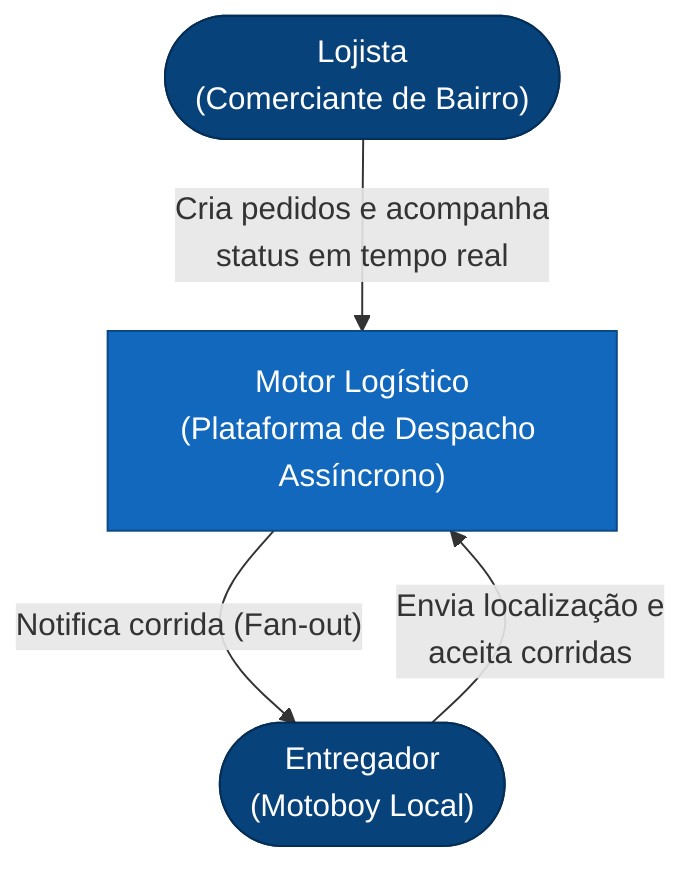
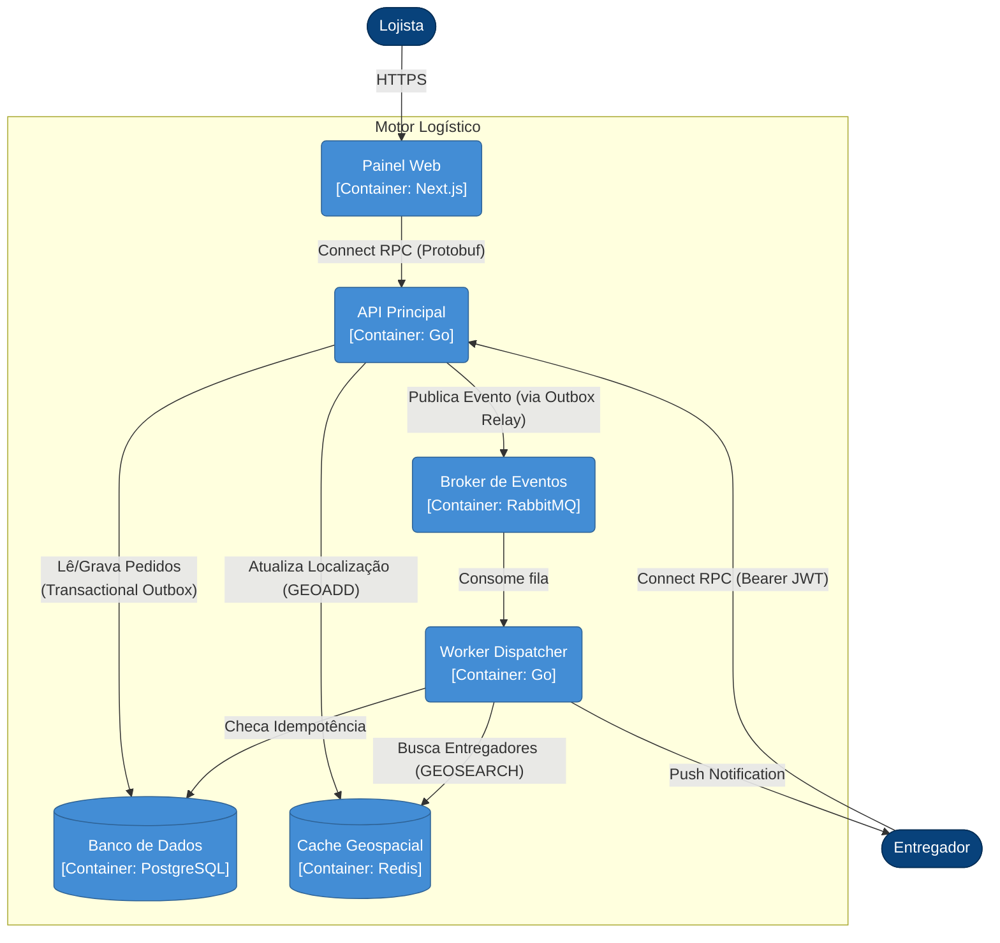

# Arquitetura e Design (DDD e SOLID)

Este documento define as fundações arquiteturais, a linguagem de negócio e a estrutura técnica da plataforma de despacho logístico. Ele serve como guia definitivo antes da implementação.

## 1. Linguagem Ubíqua (Ubiquitous Language)

Para garantir que o código, o banco de dados e as discussões de negócio utilizem a mesma terminologia, definimos:

- **Merchant (Lojista):** O pequeno comércio de bairro (padaria, farmácia) que cria as solicitações de entrega.
- **Order (Pedido):** A solicitação de entrega de mercadorias, contendo destino, valor e dados do cliente.
- **Deliverer (Entregador/Motoboy):** O profissional logístico local responsável por realizar o transporte.
- **Delivery (Entrega):** O acoplamento entre um Order e um Deliverer (a viagem em si).
- **Dispatch (Despacho):** O processo sistêmico de encontrar entregadores e ofertar a eles um Order.
- **Fan-Out:** A emissão paralela de um alerta (oferta de corrida) para múltiplos entregadores na região.

## 2. Bounded Contexts (DDD Tático)

O sistema é dividido em três contextos limitados (*Bounded Contexts*), garantindo alto grau de coesão e isolamento de falhas:

| Bounded Context | Responsabilidade Primária | Agregado Raiz |
|---|---|---|
| **Order (Pedidos)** | Ciclo de vida do pedido e regras de transição de estado. | `Order` |
| **Dispatch (Despacho)** | Encontrar candidatos, emitir Fan-Out, resolver aceite concorrente. | `DispatchService` (Serviço de Domínio) |
| **Fleet (Frota)** | Cadastro, localização e disponibilidade de entregadores. | `Deliverer` |

### Agregados e Invariantes
A lógica de negócio deve residir nas Entidades de Domínio. Por exemplo, a transição de estado de um Pedido é responsabilidade do agregado `Order`, que garante a validade da operação e emite **Eventos de Domínio**:

```go
// internal/order/domain/order.go
func (o *Order) Accept(delivererID uuid.UUID) error {
    if o.Status != StatusDispatched {
        return ErrInvalidTransition // Invariante: não pode aceitar o que não foi despachado
    }
    o.Status = StatusAccepted
    o.DelivererID = &delivererID
    
    // Gera o Domain Event (que depois será enviado via Outbox)
    o.raiseEvent(NewDeliveryAcceptedEvent(o.ID, delivererID))
    return nil
}
```

## 3. SOLID e Monolito Modular em Go Idiomático

A arquitetura respeita o *Clean Architecture* e *Hexagonal*, mas com uma roupagem **estritamente idiomática ao Go (Modular Monolith)**. Em Go, evitamos pacotes com nomes de camadas genéricas ("javismos" como `models`, `services`, `domain`, `infrastructure`). Em vez disso, organizamos o código por **Bounded Contexts autônomos**, onde cada módulo pode ser extraído para um microsserviço no futuro com mínimo esforço.

- **Pacotes por Propósito:** O nome do pacote dita o que ele *fornece*. O pacote `order` contém as entidades e regras de negócio; o pacote `postgres` contém a implementação de persistência.
- **DIP (Dependency Inversion):** O pacote raiz de um contexto (`order`) define as *interfaces* que precisa (ex: `order.Repository`). O subpacote `postgres` as implementa.
- **ISP (Interface Segregation):** Interfaces pequenas (ex: `OrderReader`, `OrderWriter`).
- **SRP (Single Responsibility):** O handler HTTP de pedido (`order/http`) não sabe fazer SQL. Ele recebe a interface do domínio.

*Convenção Go:* `accept interfaces, return structs`.

## 4. Estrutura de Pastas (Monorepo)

O projeto adota a estratégia de Monorepo (ADR-011) para facilitar o compartilhamento dos contratos Protobuf. A raiz do repositório é dividida nas seguintes vertentes:

```text
/docs               -> Documentações de arquitetura (ADRs, Dicionários, Manuais)
/proto              -> Única Fonte da Verdade: Arquivos .proto definindo a API (Connect RPC)
  /logistics/v1
/api                -> Backend (Monolito Modular em Go)
/web                -> Frontend (Next.js App Router)
```

### Backend (Golang: `/api`)
Organizado por contexto de negócio de forma autônoma. Se decidirmos extrair "Fleet" para um microsserviço, basta mover a pasta `/api/internal/fleet` para um novo repositório e ajustar o `cmd`.

```text
/api
  /cmd
    /logistics-api  -> O "Monolito": injeta dependências (wire), levanta o servidor HTTP e os workers

  /internal
    /order          -> Domínio de Pedidos: Entidades (Order), Use Cases e Interfaces
      /postgres     -> Implementação acoplada ao banco relacional
      /rpc          -> Handlers Connect RPC (depende da raiz /order)

    /dispatch       -> Domínio de Despacho: Lógica de roteamento
      /rabbitmq     -> Consumer (escuta OrderPlaced) e Publisher (Fan-out)
      
    /fleet          -> Domínio de Frota e Localização: Entregadores
      /postgres     -> Cadastro persistente
      /redis        -> Ingestão de localização em tempo real (GEOADD/GEOSEARCH)
      /rpc          -> Handlers Connect RPC (UpdateLocation)

  /pkg              -> Código utilitário transversal e reaproveitável
    /logger         -> Wrapper do slog/zap
```

### Frontend (Next.js: `/web`)
Organizado por *Features*, espelhando os Bounded Contexts.

```text
/web
  /app
    /(auth)/login/page.tsx
    /(dashboard)
      /layout.tsx
      /orders
        page.tsx             -> Lista consumindo Server Streaming (Connect)
        [id]/page.tsx        -> Detalhe do pedido
```

/features
  /orders
    /components              -> UI específica de pedidos (OrderCard, StatusBadge)
    /hooks
      useOrderStream.ts      -> Hook para SSE
      useOrders.ts           -> SWR / React Query para fetch
    /api.ts                  -> Fetchers tipados (Contrato explícito)
    /types.ts                -> DTOs espelhando o backend

/components/ui               -> Design System genérico (botões, modais)
/lib
  /api-client.ts             -> Wrapper de fetch (Auth Headers)
```

## 5. Modelo de Dados Conceitual

Mapeamento lógico das entidades e relações de banco (físico suportado por PostgreSQL):

- **Merchant (1) -> (N) Order:** Um lojista cria muitos pedidos.
- **Order (1) -> (1) Delivery:** Cada pedido gera exatamente uma entrega ativa.
- **Deliverer (1) -> (N) Delivery:** O entregador pode aceitar e concluir múltiplas entregas ao longo do tempo.
- **OutboxEvent:** Tabela infraestrutural associada transacionalmente aos inserts/updates do Agregado raiz (`Order`).
- **ProcessedEvent:** Tabela infraestrutural usada pelos consumers da Fila para garantir idempotência.

## 6. Diagramas Visuais (C4 Model)

Para uma visão clara da arquitetura de produção, utilizamos o modelo C4 renderizado via Mermaid.

### Nível 1: Contexto do Sistema

Demonstra a relação dos atores com o motor logístico como um todo.



### Nível 2: Containers

Detalha as peças técnicas que compõem o motor logístico (Microsserviços, Banco e Mensageria).


