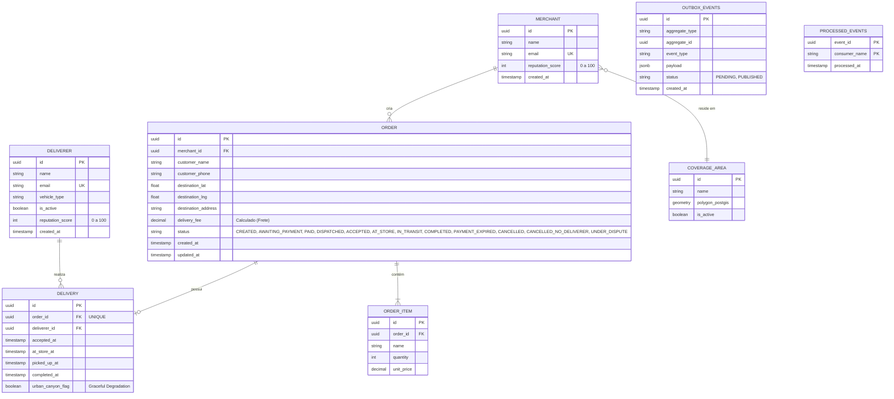

# Dicionário de Dados e Modelo Relacional (PostgreSQL)

Este documento centraliza o design do banco de dados relacional. Como adotamos a arquitetura de Monolito Modular e o padrão de Ingestão via Redis (ADR-007), o PostgreSQL será utilizado exclusivamente para dados transacionais (ACID) e cadastrais duráveis.

## 1. Diagrama Entidade-Relacionamento (ERD)

Abaixo, o modelo conceitual de relacionamento entre as tabelas do sistema, renderizado via Mermaid.

## 2. Dicionário de Tabelas

### Domínio: Lojista (`merchants`)
Armazena o perfil dos lojistas que utilizam a plataforma para despachar entregas.
- `id` (UUID, Primary Key): Identificador único do lojista.
- `name` (VARCHAR): Nome comercial ou Razão Social.
- `email` (VARCHAR, Unique): E-mail para login/contato.
- `reputation_score` (INTEGER): Pontuação de 0 a 100 baseada em cancelamentos e disputas.
- `created_at` (TIMESTAMP): Data de cadastro.

### Domínio: Frota (`deliverers`)
Armazena o perfil dos entregadores parceiros. 
*(Nota: Coordenadas em tempo real ficam no Redis, não aqui - ver ADR-007).*
- `id` (UUID, Primary Key): Identificador único do entregador.
- `name` (VARCHAR): Nome completo.
- `email` (VARCHAR, Unique): E-mail para login.
- `vehicle_type` (VARCHAR): Tipo do veículo (MOTO, BICYCLE).
- `is_active` (BOOLEAN): Flag indicando se o entregador está disponível para receber corridas.
- `reputation_score` (INTEGER): Pontuação de 0 a 100 afetando o Fan-out (delay artificial).
- `created_at` (TIMESTAMP): Data de cadastro.

### Domínio: Áreas de Cobertura (`coverage_areas`)
Limites operacionais da plataforma. Pedidos fora destas áreas são rejeitados no RF01.
- `id` (UUID, Primary Key): ID da área.
- `name` (VARCHAR): Nome descritivo da região piloto.
- `polygon_postgis` (GEOMETRY/POLYGON): Polígono geográfico gerenciado pelo PostGIS (`ST_Contains`).
- `is_active` (BOOLEAN): Flag de ativação da área.

### Domínio: Pedidos (`orders`)
Agregado Raiz do contexto de Pedidos. Guarda os metadados do pedido e seu estado lógico.
- `id` (UUID, Primary Key): Identificador único.
- `merchant_id` (UUID, Foreign Key): Referência ao Lojista.
- `customer_name` (VARCHAR): Nome do cliente final (recebedor).
- `customer_phone` (VARCHAR): Telefone do cliente final (usado no webhook/pagamento).
- `destination_lat` / `destination_lng` (DOUBLE PRECISION): Coordenadas geográficas do destino.
- `destination_address` (VARCHAR): Endereço por extenso.
- `delivery_fee` (DECIMAL 10,2): Frete calculado pela plataforma (`Taxa_Base + Distância * Taxa`).
- `status` (VARCHAR): Máquina de estado completa (`CREATED`, `AWAITING_PAYMENT`, `PAID`, `DISPATCHED`, `ACCEPTED`, `AT_STORE`, `IN_TRANSIT`, `COMPLETED`, `PAYMENT_EXPIRED`, `CANCELLED`, `CANCELLED_NO_DELIVERER`, `UNDER_DISPUTE`). A transição para ACCEPTED usa *Atomic State Update*.
- `created_at` / `updated_at` (TIMESTAMP): Auditoria temporal.

### Domínio: Itens do Pedido (`order_items`)
Relacional forte para garantir integridade e suportar estorno parcial.
- `id` (UUID, Primary Key): Identificador do item.
- `order_id` (UUID, Foreign Key): Vínculo com o Pedido.
- `name` (VARCHAR): Nome do item (ex: Hambúrguer Clássico).
- `quantity` (INTEGER): Quantidade.
- `unit_price` (DECIMAL 10,2): Preço unitário.

### Domínio: Entregas (`deliveries`)
Tabela de acoplamento entre o Pedido e o Entregador que aceitou a corrida.
- `id` (UUID, Primary Key): Identificador da entrega logística.
- `order_id` (UUID, Foreign Key, UNIQUE): Vínculo 1:1 rigoroso com o Pedido.
- `deliverer_id` (UUID, Foreign Key): Entregador alocado.
- `accepted_at` (TIMESTAMP): Momento em que o entregador aceitou (RF03).
- `at_store_at` (TIMESTAMP): Check-in do entregador na loja (SLA de 15 min, validado via GPS).
- `picked_up_at` (TIMESTAMP): Momento em que a mercadoria é recolhida (`IN_TRANSIT`).
- `completed_at` (TIMESTAMP): Momento de finalização da entrega (`COMPLETED`).
- `urban_canyon_flag` (BOOLEAN): Flag de auditoria ativada quando há Graceful Degradation (PIN correto, mas GPS > 50m e < 300m).

### Suporte Infraestrutural: Transactional Outbox (`outbox_events`)
Implementa o padrão descrito no ADR-002 para garantir que eventos de domínio sejam publicados no RabbitMQ de forma consistente com os dados do Postgres.
- `id` (UUID, Primary Key): ID do evento.
- `aggregate_type` (VARCHAR): Nome do agregado (ex: `Order`).
- `aggregate_id` (UUID): ID da entidade que sofreu mutação.
- `event_type` (VARCHAR): Tipo do evento (ex: `OrderPlaced`, `DeliveryAccepted`).
- `payload` (JSONB): O corpo do evento serializado (baseado no Protobuf).
- `status` (VARCHAR): Estado do envio (`PENDING` -> `PUBLISHED`). Com índice para polling rápido.
- `created_at` (TIMESTAMP): Momento em que o evento ocorreu no banco.

### Suporte Infraestrutural: Idempotência de Consumo (`processed_events`)
Implementa o padrão descrito no ADR-005. Protege o sistema contra re-entregas acidentais do RabbitMQ.
- `event_id` (UUID, Primary Key Composta): O ID do evento lido da fila.
- `consumer_name` (VARCHAR, Primary Key Composta): O nome lógico do consumer (ex: `dispatch_worker`).
- `processed_at` (TIMESTAMP): Data do processamento.
*(Constraint: PK(`event_id`, `consumer_name`) garante que o mesmo worker nunca processe a mesma mensagem duas vezes).*
